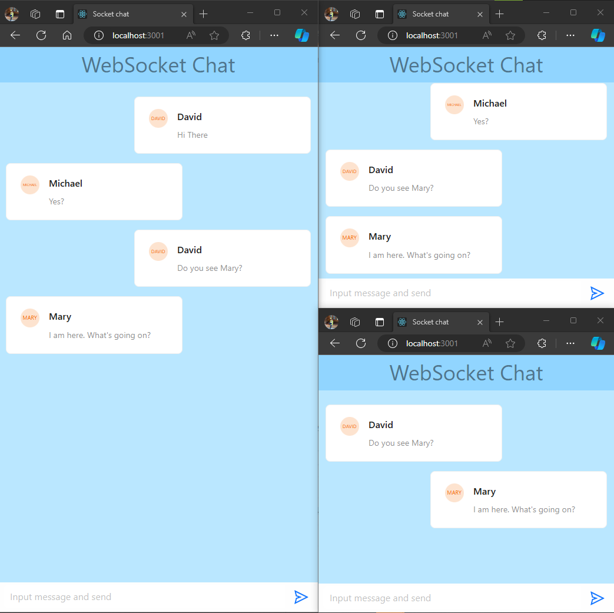

# Web Socker Demo: Server & Client
## Introduction:
* A simple websocket-base chat app with backend () and frontend ()
* Inspired by: https://www.youtube.com/watch?v=LenNpb5zqGE
* Improvements:
    * Hide scroll bar using CSS & SimpleBar
    * Chat history can be automatically scrolled to the end
    * Written using Function Components, working with Node v18 and later

Screenshot:

## Step by step
### Step 1: Create server app
    mkdir webSocketServer
    cd webSocketServer
    npm init

Create `index.js`

Start script should be `node index.js`

    "start": "set PORT=8002 && node index.js"

Run the program

    npm start
### Step 2: Create server app
Init

    mkdir webSocketClient
    cd webSocketClient
    npm init

Add packages

    npm install --save websocket react react-dom react-scripts antd

Create `public/index.html`, `src/index.js`, `src/index.css`

Important: Different from a normal node program, react program should uses `react-scripts`

    "start": "set PORT=3001 && react-scripts start"

Start the program:

    npm start

## Others
* Fix complaining about `React.render` & `ReactDOM` import: https://stackoverflow.com/a/71668419/9002449
* Websocket security best practices: https://ably.com/topic/websocket-security